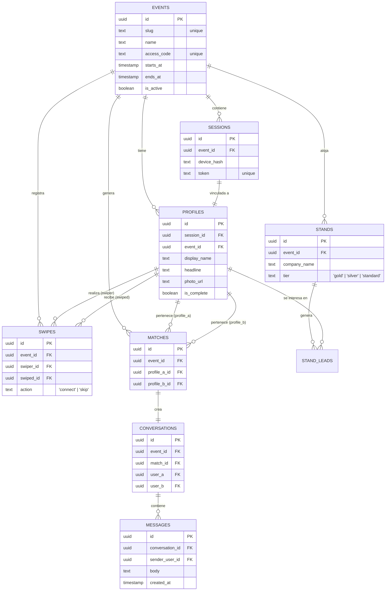

# 📊 Diagrama ERD - LinkiaEvent

Este diagrama describe la estructura de la base de datos en Supabase y las relaciones entre las entidades principales del sistema.

---

## 🔑 Conceptos Clave de la DB

1.  **Event Centric**: Casi todas las tablas están particionadas lógicamente por `event_id`. Esto permite que un mismo usuario (o dispositivo) tenga experiencias y perfiles totalmente aislados entre diferentes eventos.
2.  **Sesiones vs Auth**: No usamos el sistema de Auth tradicional de Supabase basado en email/password por defecto. Usamos una tabla de `sessions` vinculada a un `device_hash` para permitir un acceso instantáneo sin fricción.
3.  **Matches**: Un `match` es la unión de dos perfiles que se han dado "connect" mutuamente. Al crearse un match, el sistema dispara automáticamente la creación de una `conversation`.
4.  **Stands y Leads**: Los expositores (`stands`) pueden recolectar información de los perfiles que demuestran interés a través de la tabla `stand_leads`.
